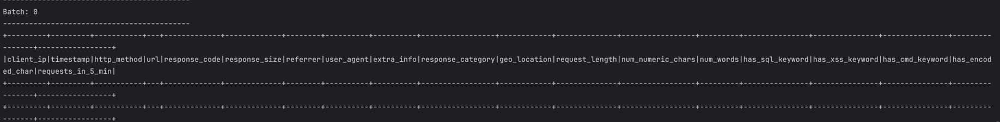

# anomaly-data-preprocesssing

This repository is meant to track the data preprocessing effort.

# Steps to run the Spark Application

1. Create a python venv

     `python3 -m venv venv`
2. Activate the venv

   `source venv/bin/activate`
3. Install all dependencies from requirements.txt
4. Install Kafka if not already done
5. Start Zookeeper

     `zookeeper-server-start.sh $KAFKA_HOME/config/zookeeper.properties`
6. Start Kafka

     `kafka-server-start.sh $KAFKA_HOME/config/server.properties`
7. Create kafka topics if not already existing: _**processed_logs**_, **_raw_logs_**

     `kafka-topics.sh --create --topic processed_logs --bootstrap-server localhost:9092 --partitions 3 --replication-factor 1`
8. Start the app

      `uvicorn main:app --reload`
9. Run the consumer
 `python kafka_consumer.py`
10. Once you see that consumer has run successfully and showing Batch 0 with empty columns, run the producer
`python kafka_producer.py`

11. To monitor if logs are being produced and consumed, monitor the topics

     `kafka-console-consumer.sh --bootstrap-server localhost:9092 --topic raw_logs`